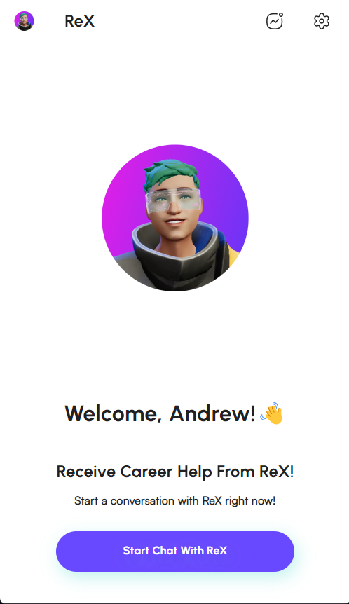
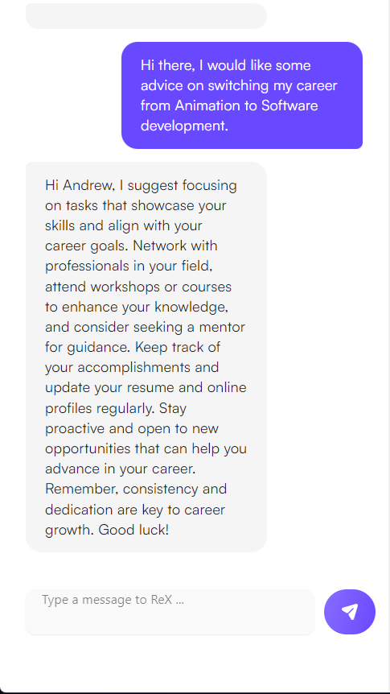
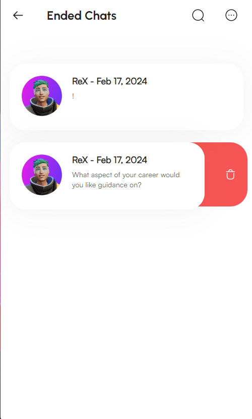
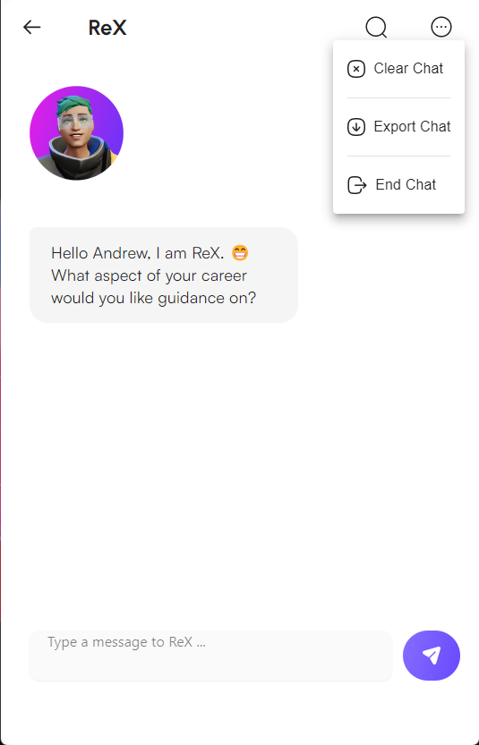
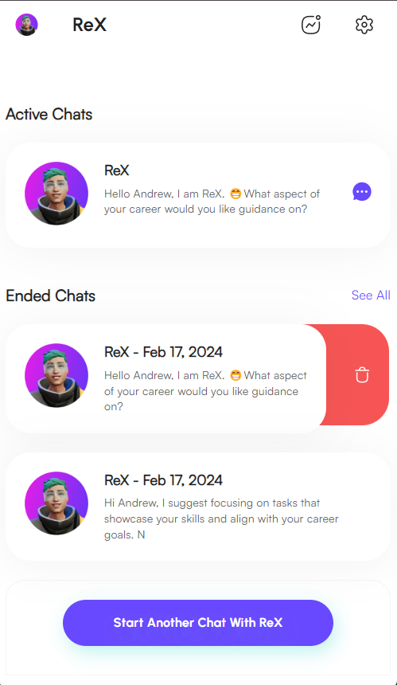
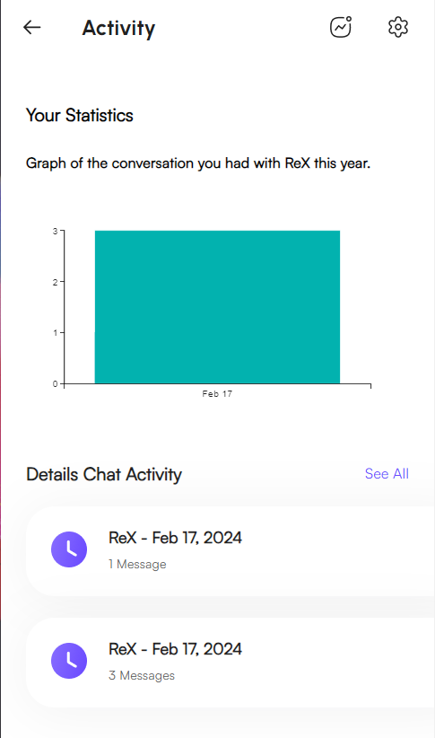

# CosmoChat UI

## Description
This is an app where the user named Andrew interacts with an openAI powered career advice assistant name ReX. This is a beginner mission done during my internship at RadicalX.

## Tools used
Reacr.JS, Material UI, Framer Motion, Axios, Open AI. 

## Acknowledgement 
Special Thanks to my mentor Billy Bett for helping me get through my blockers and RadicalX CEO Talha Sabri for this opportunity. 

## Screen Shots

### Welcome Page

### Home Page

### Chat Window with openAI response

### Ended Chats List

### Chat Menu

### Delete Button on Home Page

### Activity Page

## Loom Video
Click [here](https://www.loom.com/share/4d74f124970447a99a97a609052f46c1?sid=d159bf20-6581-49d5-a951-5056bb52526f) to watch the demonstration.

## About RadicalX

RadicalX is pioneering an immersive digital world designed specifically for Gen Z developers.